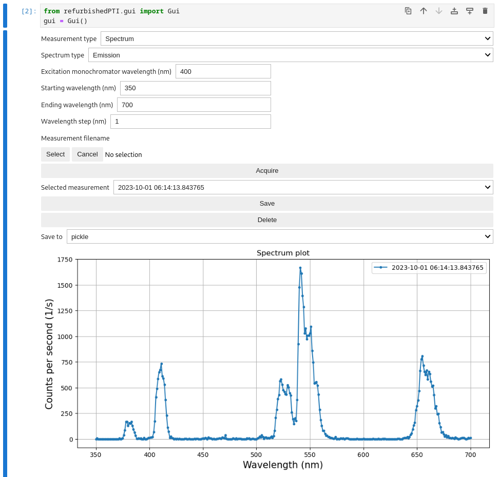
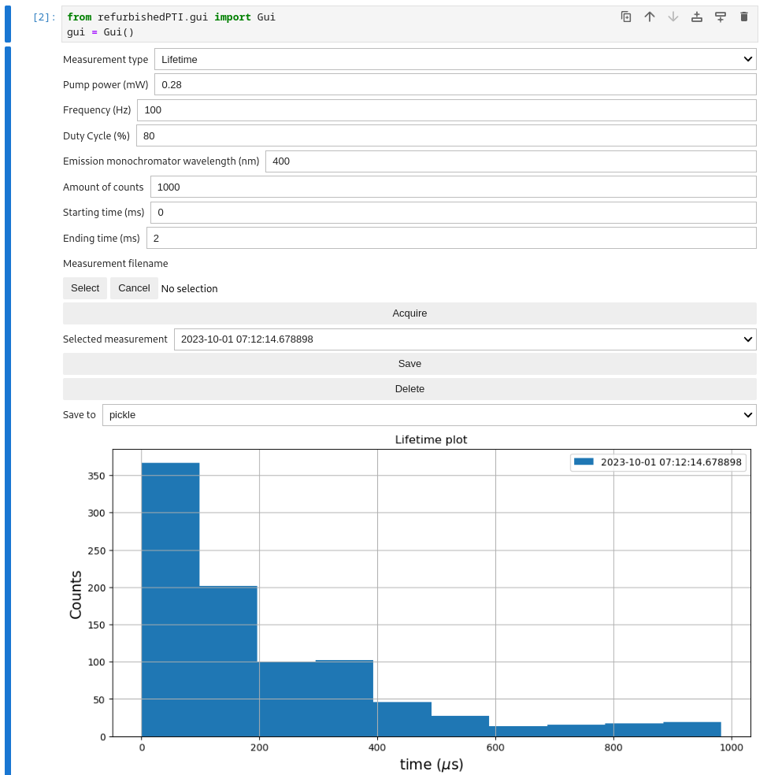

# RefurbishedPTI

RefurbishedPTI is a Python package that provides software for the hardware control of a refurbished Horiba PTI spectrometer.
RefurbishedPTI is meant to run in a Red Pitaya that controls the spectrometer's hardware components as explained in [DOI].

This package allows the user to take emission and excitation spectrums remotely and asynchronically, replacing the need to use propietary FelixGX control software running on outdated PCs.
On top of that, it adds the funcionality to measure lifetimes ranging from $260 \mu s$  up to $8 ms$ by controling an ITC4020 benchtop laser power supply.
Minor adjustments can be made to the software to adapt it to the user specific needs.

## Usage

**Warning**: before attempting to control the spectrometer, make sure to perform all hardware modifications specified in [DOI].

RefurbishedPTI provides two ways of operation: through an ipywidgets GUI, or programatically through the Spectrometer API class.

### GUI

Open the ```/home/jupyter/refurbishedPTI/gui.ipynb``` notebook and run the first cell

```python
from refurbishedPTI.gui import GUI
gui = GUI()
```

that will execute the GUI. 
Choose **Spectrum** in the **Measurement type** dropdown to measure a spectrum. 
The spectrum measurement GUI will appear.



Configure and start the measurement by using the GUI components specified in the following table.

| Parameter Name                    | Description                                                                                                                                                     |
|-----------------------------------|-----------------------------------------------------------------------------------------------------------------------------------------------------------------|
| **Spectrum type**                 | **Emission**: fixed excitation monochromator and scanning emission monochromator.                                                                                |
|                                   | **Excitation**: fixed emission monochromator and scanning excitation monochromator.                                                                              |
|                                   | **Laser**: scanning emission monochromator with external laser excitation.                                                                                       |
| **Static monochromator wavelength** | Fixed monochromator wavelength (nm).                                                                                                                            |
| **Starting wavelength**           | Starting wavelength of the scanned wavelength range (nm).                                                                                                        |
| **Ending wavelength**             | Ending wavelength of the scanned wavelength range (nm).                                                                                                          |
| **Wavelength step**               | Difference in wavelength between each data point (nm).                                                                                                           |
| **Acquire**                       | Starts the measurement.                                                                                                                                          |


To take a lifetime measurement, select **Lifetime** in the **Measurement type** dropdown.
The lifetime measurement GUI will appear.



Configure and start the measurement by using the GUI components specified in the following table.

| Parameter Name                        | Description                                                    |
|---------------------------------------|----------------------------------------------------------------|
| **Pump power**                        | Laser pump power (mW)                                          |
| **Frequency**                         | Laser on and off TTL signal frequency                          |
| **Duty Cycle**                        | Duty cycle of TTL signal in %                                   |
| **Emission monochromator wavelength** | Wavelength at which the lifetime will be measured (nm).        |
| **Amount of counts**                  | Amount of counts that will be measured until the measurement ends.|
| **Starting time**                     | Time after trigger before start counting (ms).                 |
| **Ending time**                       | Time after trigger before stop counting (ms).                  |
| **Acquire**                           | Starts the measurement.                                        |


After acquiring a measurement, save and manipulate the data with the GUI components specified in the following table.

| Parameter Name          | Description                                                                                                                                                                                                                           |
|-------------------------|---------------------------------------------------------------------------------------------------------------------------------------------------------------------------------------------------------------------------------------|
| **Measurement filename**| Select a filename and directory where the measurement will be saved once the **Save** button is pressed. If no filename is selected at the time of pressing the **Acquire** button, the filename will be the current date and time.   |
| **Selected measurement**| Select a measurement to **Save** it or **Delete** it.                                                                                                                                                                                 |
| **Save**                | Save measurement with selected filename, directory, and format.                                                                                                                                                                       |
| **Delete**              | Delete selected measurement.                                                                                                                                                                                                          |
| **Save to**             | File format for the saved measurement. Options:                                                                                                                                                                                       |
|                         | **pickle**                                                                                                                                                                                                                            |
|                         | **csv**                                                                                                                                                                                                                               |
|                         | **excel**                                                                                                                                                                                                                             |

### Spectrometer API

To take a spectrum measuremen, import and initialize the Spectrometer

```python
from refurbishedPTI.instruments import Spectrometer
spec = Spectrometer.constructor_default()
```

home the monochromators

```python
spec.home()
```

and make an emission spectrum measurement by calling

```python
df = spec.get_emission(
    integration_time=0.01,     # In seconds
    excitation_wavelength=400, # In nanometers
    starting_wavelength=500,   # In nanometers
    ending_wavelength=700,     # In nanometers
    wavelength_step=1          # In nanometers
)
```

which returns a Pandas DataFrame with wavelength, counts, and integration time as columns.
Get an excitation spectrum in a simmilar manner by calling get_excitation.by calling get_excitation.

To take a lifetime measurement import and initialize the ITC4020 laser power supply class

```python
from refurbishedPTI.instruments import ITC4020
itc = ITC4020(config_path)
```

configure it for the desired measurement and turn on the laser

```python
itc.qcw_mode = True
itc.frequency(100) # Sets frequency at 100 Hz
itc.current(0.1)   # Sets current at 0.1 A
itc.duty_cycle(80) # Sets the duty cycle at 80%
itc.laser_on(True)
```

and finally configure the spectrometer and start the measurement by calling acquire_decay method

```python
spec.set_decay_configuration()
counts = spec.acquire_decay(
    t0=0,               # In ms after trigger
    tf=2,               # In ms after trigger
    amount_counts=1000, # Amount of counts
)
```

which returns a Pandas DataFrame with a single column called arrival_times, that has the photon arrival times.